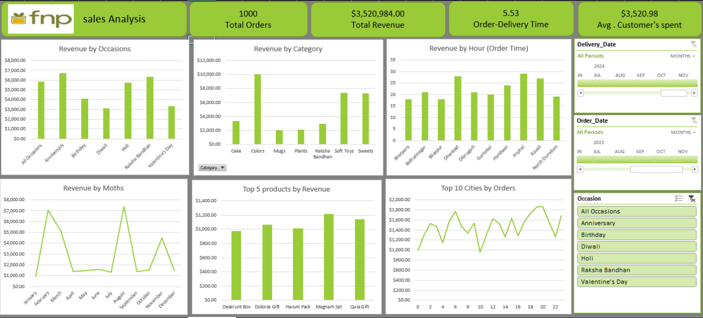

# Sales Analysis Dashboard

<!-- Add your dashboard screenshot here -->

## Description  
A comprehensive sales analysis dashboard built in Excel to visualize order patterns, revenue trends, and business performance metrics. Includes KPIs, pivot tables, and charts derived from **1,000 sales records**.

## Languages and Utilities Used  
- Microsoft Excel (Pivot Tables, Charts, Formulas)  
- Data Visualization (Bar charts, line graphs, pie charts)  

## Environments Used  
- Microsoft Excel (Windows/macOS)  

## Data Highlights  
- **Total Orders**: 1,000  
- **Total Revenue**: ₹3,520,984.00  
- **Average Order Value**: ₹3,520.98  
- **Order-Delivery Time**: 5.53 days (avg)  
- **Top Categories**: Cake, Mugs, Plants  
- **Peak Occasions**: Diwali, Valentine’s Day, Raksha Bandhan  
- **Top Products**: Desert Box, Dolores Gift, Magnam Pack  

[Download Excel File](project 1.xlsx)
